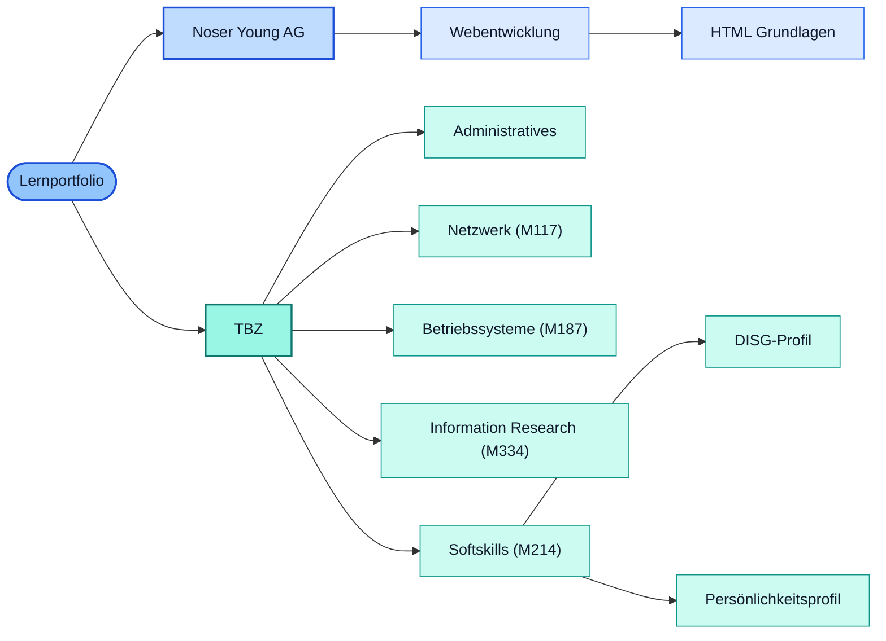

Eine Übersicht über alle Bereiche und Module des Portfolios.

```mermaid
flowchart LR
  L(["Lernportfolio"]):::root
  L --> N["Noser Young AG"]:::noser
  L --> T["TBZ"]:::tbz
  N --> W["Webentwicklung"]:::noser2
  W --> H["HTML Grundlagen"]:::noser2
  T --> A["Administratives"]:::tbz2
  T --> M117["Netzwerk (M117)"]:::tbz2
  T --> M187["Betriebssysteme (M187)"]:::tbz2
  T --> M334["Information Research (M334)"]:::tbz2
  T --> M214["Softskills (M214)"]:::tbz2
  M214 --> D["DISG-Profil"]:::tbz2
  M214 --> P["Persönlichkeitsprofil"]:::tbz2
  classDef root fill:#93c5fd,stroke:#1d4ed8,stroke-width:2px,color:#0f172a
  classDef noser fill:#bfdbfe,stroke:#1d4ed8,stroke-width:2px,color:#0f172a
  classDef noser2 fill:#dbeafe,stroke:#2563eb,color:#0f172a
  classDef tbz fill:#99f6e4,stroke:#0f766e,stroke-width:2px,color:#0f172a
  classDef tbz2 fill:#ccfbf1,stroke:#0d9488,color:#0f172a
```

Start: [[Überblick Noser Young AG]] · [[Überblick TBZ]]
